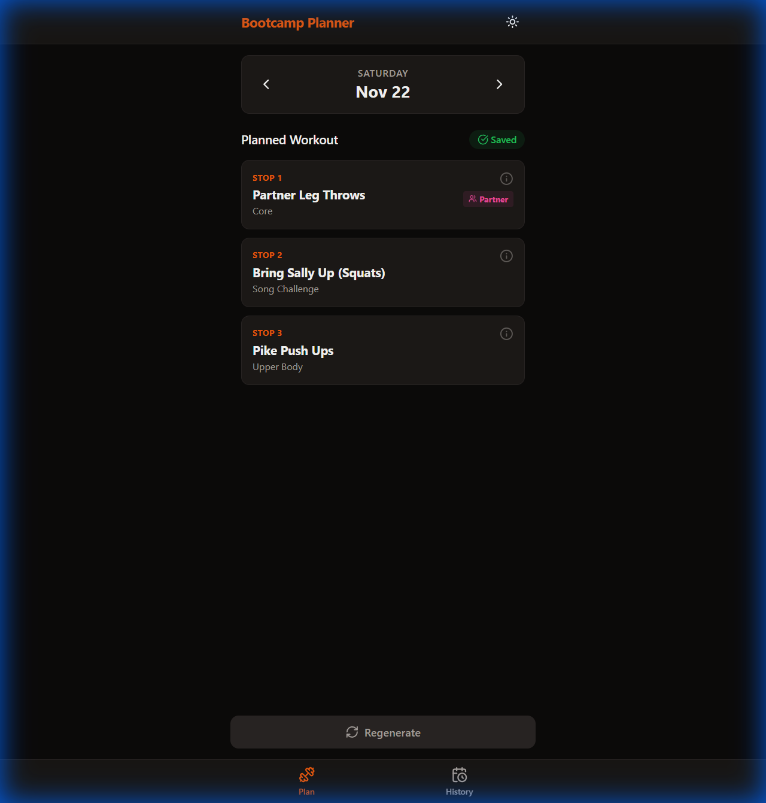

# Bootcamp Workout Planner

A mobile-first web application designed to help fitness instructors quickly generate, manage, and track Tabata-style workouts.



## Features

*   **Smart Workout Generation**: Automatically pairs "Waiting" exercises (while the group gathers) with "Main" exercises.
*   **Exercise Management**: Add, edit, and delete exercises. Categorize them by type (Cardio, Core, Upper, Lower, etc.) and mark them as "Waiting" or "Partner" exercises.
*   **History Tracking**: Keep a log of all past workouts. Delete old entries as needed.
*   **Mobile Optimized**: Designed to look and feel like a native app on your phone.
*   **PWA Support**: Installable on iOS and Android home screens.
*   **Dark/Light Mode**: Toggle between themes.
*   **Cloud Sync**: Powered by Supabase for real-time data across devices.

## Screenshots

### Exercise List
Manage your exercise bank with ease.


### Add Exercise
Quickly add new moves to your library.


### Exercise Details
View instructions and details for every move.


## Tech Stack

*   **Frontend**: React, Vite, Tailwind CSS
*   **Backend**: Supabase (PostgreSQL)
*   **Icons**: Lucide React
*   **Date Handling**: date-fns

## Getting Started

### Prerequisites

*   Node.js installed
*   A Supabase account

### Installation

1.  Clone the repo:
    ```bash
    git clone https://github.com/yourusername/bootcamp-planner.git
    ```
2.  Install dependencies:
    ```bash
    npm install
    ```
3.  Create a `.env` file in the root directory and add your Supabase credentials:
    ```env
    VITE_SUPABASE_URL=your_supabase_url
    VITE_SUPABASE_ANON_KEY=your_supabase_key
    ```
4.  Run the development server:
    ```bash
    npm run dev
    ```

## Deployment

This app is ready for deployment on Vercel or Netlify.

See the [DEPLOYMENT_GUIDE.md](DEPLOYMENT_GUIDE.md) for step-by-step instructions.

## License

MIT
